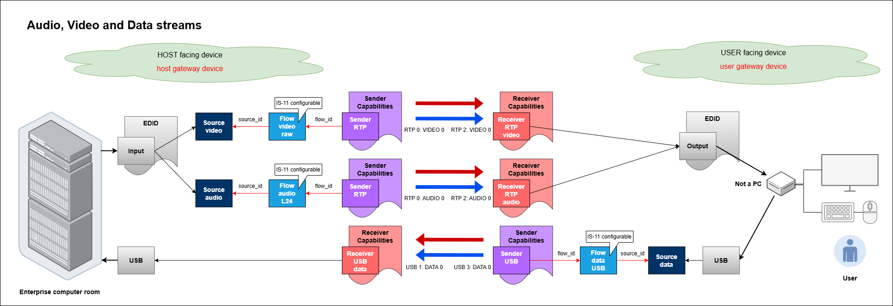

# AMWA BCP-007-02: NMOS With IPMX/USB
{:.no_toc}  
---
  
{:toc}

## Introduction

The VSF/IPMX [TR-10-14][] technical recommendation defines the transport of a USB stream over TCP/IP. It enables the multiplexed transport of keyboard, mouse, data, audio, and video sub-streams over TCP/IP. Senders and Receivers using the USB transport have their `format` attribute set to `urn:x-nmos:format:data` and their `transport` attribute set to  `urn:x-nmos:transport:usb`. The `media_type` attribute of a USB Receiver is `application/usb`, and the `media_type` of a data Flow connected to a USB Sender is also `application/usb`.

The content of a USB stream is not exposed at the NMOS level. It is treated as an opaque data stream. A USB Receiver connected to a USB Sender gains access to the USB devices available at the Sender. Each such device is represented by a corresponding multiplexed data sub-stream. Devices may be plugged or unplugged dynamically without affecting the connection between the Receiver and Sender, or the associated Source, Flow, and Sender resources.

The roles of USB Senders and Receivers may initially appear counterintuitive due to their physical placement within devices. Consider a KVM system in which a User interacts with a local KVM endpoint that connects to a remote computer over the network. The remote computer outputs video and audio; therefore, the audio and video Senders reside on the remote computer, and the corresponding Receivers reside on the local KVM endpoint. Conversely, the local KVM endpoint provides keyboard, mouse, and storage devices; hence, the USB Sender resides at the local KVM endpoint, while the USB Receiver is located on the remote computer.



KVM systems are often sensitive to privacy and security. The [TR-10-14][] technical recommendation includes built-in support for privacy encryption. Given that USB streams are unlikely to be used without privacy encryption, the [TR-10-14][] technical recommendation retains the privacy encryption components in the protocol messages, even when encryption is not enabled. For more details on privacy-encrypted USB streams, refer to the [BCP-005-03][] "NMOS With Privacy Encryption" document.

## Use of Normative Language

The key words "MUST", "MUST NOT", "REQUIRED", "SHALL", "SHALL NOT", "SHOULD", "SHOULD NOT", "RECOMMENDED", "MAY", and "OPTIONAL" in this document are to be interpreted as described in [RFC 2119][RFC-2119].

## Definitions

The NMOS terms 'Controller', 'Node', 'Source', 'Flow', 'Sender', 'Receiver' are used as defined in the [NMOS Glossary](https://specs.amwa.tv/nmos/main/docs/Glossary.html), however Sources, Flows, Senders and Receivers referred to in this document are USB Sources, USB Flows, USB Senders and USB Receivers unless otherwise specified.

'Capabilities' are used by IS-04 Senders and Receivers to indicate what they can generate and consume respectively.

## USB IS-04 Sources, Flows and Senders

Nodes that are capable of transmitting USB data streams MUST expose Source, Flow and Sender resources in the IS-04 Node API.

Nodes compliant with this specification MUST implement IS-04 v1.3 or higher, and IS-05 v1.1 or higher.

### Sources

A USB Source resource MUST set the `format` attribute to `urn:x-nmos:format:data` and MUST be associated with a Flow of the same `format` via the `source_id` attribute of the Flow. 

A USB Source MAY include a `usb_devices` attribute, which is an array of `usb_device` objects. This attribute describes the USB devices accessible to a Receiver via the USB data stream. Inclusion of this information is optional.

A `usb_device` object is defined as:

```
{
    "ipmx_bus_id": [64]integer, // IPMX USB UTF-8 BUSID 64 byte value (integers in the range 0 to 255)
    "class": []integer,         // class of a device or classes if a composite device (integers in the range 0 to 255)
    "vendor": integer,          // vendor id (integer in the range 0 to 65535)
    "product": integer,         // product id (integer in the range 0 to 65535)
    "serial": string,           // serial number (empty string "" if not available)
}
```

The JSON schema defining the `usb_device` object is available in the [NMOS Parameter Registers][] at the section defining [NMOS Source Attributes](https://github.com/AMWA-TV/nmos-parameter-registers/tree/main/source-attributes).

The `ipmx_bus_id` attribute is represented as an array of 64 bytes as in the messages defined by [TR-10-14][]. A Controller MAY present this attribute to a User as a string made of the UTF-8 character codes stored in the `ipmx_bus_id` array. The `ipmx_bus_id` array stores the original bytes of the messages to prevent issues arising from string representations that differ from the real values within the IPMX/USB stream.

Examples of Source resources are provided in [Examples](../examples/).

### Flows

A USB Flow resource MUST set the `media_type` attribute to `application/usb` and the `format` attribute to `urn:x-nmos:format:data`. A USB Flow MUST include a `source_id` attribute referencing a Source of the same `format`.

Examples of Flow resources are provided in [Examples](../examples/).

### Senders

A USB Sender resource MUST set the `transport` attribute to `urn:x-nmos:transport:usb`.

A Sender associated with a USB Flow via the `flow_id` attribute SHOULD provide Capabilities describing the characteristics of the data Flow.

The Sender MUST express its limitations or preferences regarding the USB streams it supports by indicating constraints in accordance with the [BCP-004-02][] specification. The Sender SHOULD declare its constraints as precisely as possible to allow a Controller to determine, with high confidence, the Sender's stream capabilities. It is not always practical for the constraints to enumerate every type of stream a Sender can or cannot produce; however, they SHOULD describe as many commonly used operating points as practical, along with any preferences.

The USB Sender MUST use the `constraint_sets` parameter within the `caps` object to describe supported combinations of parameters, using the parameter constraints defined in the [Capabilities Register](https://specs.amwa.tv/nmos-parameter-registers/branches/main/capabilities/) of the NMOS Parameter Registers.

A Sender SHOULD provide the `urn:x-nmos:cap:transport:usb_class` capability to indicate the USB classes (integers in the range 0 to 255) supported by the Sender. See [USB Class Codes](https://www.usb.org/defined-class-codes) for class code definitions.

A USB Sender MUST operate as a TCP/IP server and accepts connections from USB Receivers. The underlying transport protocol for `urn:x-nmos:transport:usb` MUST be TCP, and MAY optionally be using MPTCP (MultiPath TCP) for redundancy.

An example Sender resource is provided in [Examples](../examples/).

#### SDP format-specific parameters

The `manifest_href` attribute of the Sender MUST provide the URL to an SDP transport file that complies with the requirements of [TR-10-14][] and the following additional rules:

- The media description line `m=<media> <port> <proto> <fmt> ...` MUST have `<media>` set to `application`, `<proto>` set to `TCP` and `<fmt>` set to `usb`. This indicates that the `media_type` is `application/usb` and that the transport protocol is TCP, as used by `urn:x-nmos:transport:usb`.

- The connection information lines `c=<nettype> <addrtype> <connection-address>` MUST have `<connection-address>` set to the IP address of the Sender's TCP server.

- The attribute `a=setup:passive` MUST be specified.

- If redundancy is used, at most two paths (legs) MUST be specified using two separate media descriptors. The `<connection-address>` of each descriptor MUST specify a different path to the Sender's TCP server. A `a=group:DUP` session attribute MUST reference both media descriptors using their `a=mid:` attributes. The first identifier in the `a=group:DUP` session attribute MUST correspond to the first leg (path), and the second identifier to the second leg. The first leg corresponds to entry 0 of the IS-05 transport parameters array; the second leg corresponds to entry 1.

## USB IS-04 Receivers

Nodes that are capable of receiving USB data streams MUST have Receiver resources in the IS-04 Node API.

Nodes compliant with this specification MUST implement IS-04 v1.3 or higher and IS-05 v1.1 or higher.

A USB Receiver resource MUST set the `transport` attribute to `urn:x-nmos:transport:usb`.

A USB Receiver MUST set the `format` attribute to `urn:x-nmos:format:data`, MUST include `application/usb` in the `media_types` array within the caps object, and SHOULD declare the Receiver's Capabilities for the data stream.

The Receiver MUST express its limitations or preferences regarding the USB streams that it supports by declaring constraints in accordance with the [BCP-004-01][] specifications. The Receiver SHOULD express its constraints as precisely as possible, to enable a Controller to determine, with high confidence, the Receiver's compatibility with available streams. It is not always practical for the constraints to enumerate every type of stream a Receiver can or cannot consume; however, they SHOULD describe as many commonly used operating points as practical, along with any preferences.

The Receiver MUST use the `constraint_sets` parameter within the `caps` object to describe supported combinations of parameters, using the parameter constraints defined in the [Capabilities Register](https://specs.amwa.tv/nmos-parameter-registers/branches/main/capabilities/) of the NMOS Parameter Registers.

A USB Receiver SHOULD provide the `urn:x-nmos:cap:transport:usb_class` capability to indicate the USB classes (integers in the range 0 to 255) supported by the Receiver. See [USB Class Codes](https://www.usb.org/defined-class-codes) for class code definitions.

A USB Receiver MUST operate as a TCP/IP client. A USB Sender accepts connections from Receivers. The underlying transport protocol for `urn:x-nmos:transport:usb` MUST be TCP, and MAY optionally be using MPTCP (MultiPath TCP) for redundancy.

An example Receiver resource is provided in [Examples](../examples/).

### Grouping of Receivers

In some scenarios, a group of USB Receivers controls the USB sub-system of a Device. 

Receivers MUST declare a device-scope tag "urn:x-nmos:tag:grouphint/v1.0" in their `tags` attribute.

The "urn:x-nmos:tag:grouphint/v1.0" tag array MUST contain a single string formatted as "\<group-name\>:\<role-name-in-group\> \<role-index-in-group\>". This complies with the [Group Hint Tags][] format "\<group-name\>:\<role-in-group\>", where "\<role-in-group\>" is the combination of "\<role-name-in-group\>" and "\<role-index-in-group\>" separated by a space.

All USB Receivers in the group MUST share the same \<group-name\>, the \<role-name-in-group\> MUST be "DATA" and each Receiver MUST declare a unique \<role-index-in-group\> integer.

> Example: First Receiver in group is "USB 0: DATA 0", second Receiver in group is "USB 0: DATA 1", etc.

Using this grouping convention, a Controller can determine how many USB Senders simultaneously control the USB sub-system of a Device. 

## USB IS-05 Senders and Receivers

Connection Management using IS-05 proceeds in the same manner as for any other transport, using USB-specific transport parameters defined in [USB Sender transport parameters](../APIs/schemas/sender_transport_params_usb.json) and [USB Receiver transport parameters](../APIs/schemas/receiver_transport_params_usb.json). The `source_ip` and `source_port` transport parameters MUST be present in the IS-05 `active`, `staged`, and `constraints` endpoints of a USB Sender. The `source_ip`, `source_port` and `interface_ip` transport parameters MUST be present in the IS-05 `active`, `staged`, and `constraints` endpoints of a USB Receiver.

When used, redundancy MUST be implemented using MPTCP. Senders and Receivers supporting redundancy with the `urn:x-nmos:transport:usb` transport MUST NOT specify more than two sets of transport parameters. The parameters for the first leg MUST appear as entry 0 in the transport parameters array; those for the second leg MUST appear as entry 1.

For security reasons, USB streams are typically encrypted using the IPMX [TR-10-13][] Privacy Encryption Protocol. Additional `ext_privacy_*` extended transport parameters, as normatively defined in [TR-10-13][], are present in the IS-05 `active`, `staged`, and `constraints` endpoints of USB Senders and Receivers. 
Refer to the [BCP-005-03][] "NMOS Support for IPMX/PEP" document for more details.

### Receivers

A `PATCH` request on the **/staged** endpoint of an IS-05 Receiver MAY include an SDP transport file in the `transport_file` attribute. The SDP transport file for a USB stream MUST comply with the IPMX [TR-10-14][] specification but might not comply with the additional requirements specified for SDP transport files at Senders.

If the USB Receiver is not capable of consuming the stream described by the `PATCH` request, it SHOULD reject the request. If it is unable to assess stream compatibility because some parameters are missing from the `PATCH` request, it MAY accept the request and defer stream compatibility assessment.

A Controller MAY connect a USB Receiver that does not support redundancy to either leg of a Sender supporting redundancy. When connecting to a Sender that does not support redundancy, a Controller MUST set the `source_ip` and `source_port` attributes of the unused leg of a Receiver supporting redundancy to `null`.

#### Transport Parameters

| Name          | Description |
|---------------|-------------|
| `interface_ip`| MUST be set to the IP address of the Receiver’s network interface. The Receiver lists available interface addresses in the `constraints` endpoint; the special value `auto` lets the Receiver choose an interface automatically. |
| `source_ip`   | MUST be set to the IP address of the TCP server (Sender) that delivers the USB packets. A `null` value indicates the address has not yet been configured. |
| `source_port` | MUST be set to the port of the TCP server (Sender) that delivers the USB packets. Accepts either an integer within the range 0–65535, the string "auto", or `null`. If set to "auto", the default is 5004. A `null` value indicates the port has not yet been configured. |
| `ext_*`       | Vendor‑specific, future AMWA extension parameters, or `ext_privacy_*`  transport parameters specified in [TR-10-14][] and [BCP-005-03][] |


### Senders

If the IS-04 Sender's `manifest_href` attribute is not `null`, the SDP transport file returned by the **/transportfile** endpoint MUST comply with the same requirements as the SDP transport file referenced by the Sender's `manifest_href` attribute.


#### Transport Parameters

| Name          | Description |
|---------------|-------------|
| `source_ip`   | MUST be set to the IP address of the TCP server that delivers the USB packets. The Sender should enumerate available interfaces in the `constraints` endpoint; the special value `auto` lets the Sender select an interface automatically, based on its routing rules. |
| `source_port` | MUST be set to the port of the TCP server that delivers the USB packets. Accepts either an integer within the range 0–65535 or the string "auto" (defaults to 5004). |
| `ext_*`       |  Vendor‑specific, future AMWA extension parameters, or `ext_privacy_*`  transport parameters specified in [TR-10-14][] and [BCP-005-03][] |

## USB IS-11 Senders and Receivers


## Controllers
A Controller MAY use [IS-11][] active constraints in conjunction with the Sender’s `urn:x-nmos:cap:transport:usb_class` capability to constrain the Sender and ensure compliance with connected Receivers. A Sender MAY indicate its support for being constrained on this capability by enumerating `urn:x-nmos:cap:transport:usb_class` in its [IS-11][] `constraints/supported` endpoint.

> Note: There is no `usb_class` Sender attribute, as might typically be expected, because a USB stream is composed of multiple sub-streams, each of which can be associated with multiple USB classes. The set of classes present in a given USB stream often changes dynamically.

A Controller SHOULD NOT use the optional `usb_devices` attribute of a USB Source to establish compatibility for the `urn:x-nmos:cap:transport:usb_class` capability but it MAY use it to provide feedback to a User about the USB devices that would be ignored by a Receiver.


[RFC-2119]: https://tools.ietf.org/html/rfc2119 "Key words for use in RFCs"
[IS-11]: https://specs.amwa.tv/is-11/ "AMWA IS-11 NMOS Stream Compatibility Management Specification"
[BCP-004-01]: https://specs.amwa.tv/bcp-004-01/ "AMWA BCP-004-01 NMOS Receiver Capabilities"
[BCP-004-02]: https://specs.amwa.tv/bcp-004-02/ "AMWA BCP-004-02 NMOS Sender Capabilities"
[TR-10-14]: https://vsf.tv/download/technical_recommendations/VSF_TR-10-14_2024-09-24.pdf "IPMX	USB"
[TR-10-13]: https://vsf.tv/download/technical_recommendations/VSF_TR-10-13_2024-01-19.pdf "Privacy Encryption Protocol (PEP)"
[BCP-005-03]: https://specs.amwa.tv/bcp-005-03/ "AMWA BCP-005-03 NMOS With Privacy Encryption"
[NMOS Parameter Registers]:  https://github.com/AMWA-TV/nmos-parameter-registers "NMOS Parameter Registers"
[Group Hint Tags]: https://specs.amwa.tv/nmos-parameter-registers/branches/main/tags/grouphint.html "Group Hint Tags"
